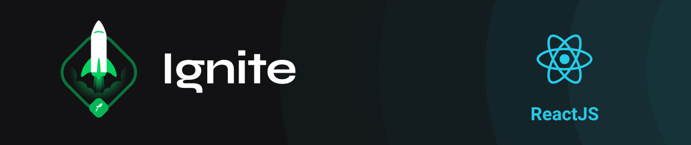

<h3 align="center">
  Challenge: Blog Space Traveling
</h3>

  
  
  
  

  <a href="#rocket-about-the-challenge">About the Challenge</a>&nbsp;&nbsp;&nbsp;|&nbsp;&nbsp;&nbsp;
  <a href="#technologies">Technologies</a>&nbsp;&nbsp;&nbsp;|&nbsp;&nbsp;&nbsp;
  <a href="#installation">Installation</a>&nbsp;&nbsp;&nbsp;|&nbsp;&nbsp;&nbsp;
  <a href="#memo-license">License</a>

 

---

## :rocket: About the Challenge

The main objective of the challenge is to create a blog. The data was consumed from Prismic, and the interface was implemented according to the Figma layout.

What was done:
- Global, common and individual stylizations;
- Importing Google fonts;
- Pagination of posts;
- Calculation of estimated post reading time;
- Generation of static pages with the `getStaticProps` and` getStaticPaths` methods;
- Date formatting with `date-fns`;
- Use of icons with 'react-icons`;
- HTTP requests with `fetch`;
- Comments with Utteranc;
- Preview of the Prismic document;
- Navigation between previous and next post;
- Post editing information.

## Technologies

- [Next.js](https://nextjs.org/)
- [Typescript](https://www.typescriptlang.org/)
- [Prismic](https://prismic.io/)
- [Utterances](https://github.com/utterance/utterances)
- [Sass](https://sass-lang.com/)
- [Date-fns](https://date-fns.org/)
- [React-icons](https://react-icons.github.io/react-icons/)

## Installation

1. Clone the repository: `git@github.com:matheus-neves/ignite-reactjs-challenge-spacetraveling.git`
2. Access the directory: `cd ignite-reactjs-challenge-spacetraveling`
3. Install the dependencies: `yarn`
4. Duplicate file `.env.local.example` and rename to `.env.local`, fill the env variables.
5. Run the app: `yarn dev`

## :memo: License

This challenge is under license from MIT. See the archive [LICENSE](https://github.com/matheus-neves/ignite-reactjs-challenge-spacetraveling/blob/main/LICENSE) for more details.

---

Challenge completed :heavy_check_mark:

Made with 💜 by Matheus Neves [See my linkedin!](https://www.linkedin.com/in/matheus-neves-front-end/) :wave:
